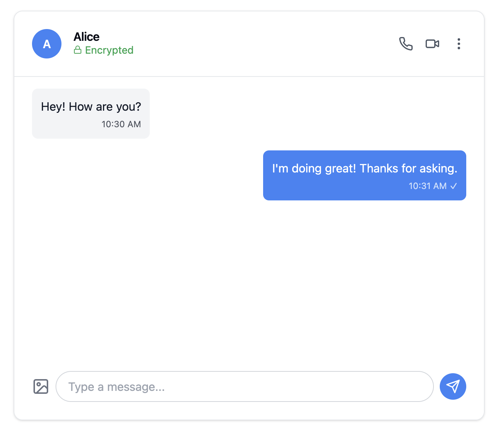

# Secure Chat App

A modern end-to-end encrypted chat application built with React and Node.js, featuring real-time messaging, push notifications, and screenshot protection.



## Features

- 🔒 End-to-end encryption using X25519 key exchange and AES-GCM encryption
- 💬 Real-time messaging with delivery status indicators
- 🔔 Push notifications for new messages
- ⏰ Message expiry after 24 hours
- 📱 Responsive design for desktop and mobile
- 🛡️ Screenshot detection and prevention
- 👤 User presence indicators
- 📞 Voice and video call support (UI prepared)
- 🖼️ Image sharing support (UI prepared)

## Security Features

- **End-to-End Encryption**: Uses X25519 for key exchange and AES-GCM for message encryption
- **Forward Secrecy**: New encryption keys for each session
- **Message Expiry**: Automatic message deletion after 24 hours
- **Screenshot Protection**: Detection of screenshot attempts
- **Encrypted Storage**: Messages are stored encrypted on the server

## Tech Stack

- **Frontend**:
  - React
  - Tailwind CSS
  - Lucide React (icons)
  - shadcn/ui components
  - Service Workers for push notifications

- **Encryption**:
  - @stablelib/x25519 for key exchange
  - AES-GCM for message encryption
  - Web Push API for notifications

## Installation

1. Clone the repository:
```bash
git clone https://github.com/yourusername/secure-chat-app.git
cd secure-chat-app
```

2. Install dependencies:
```bash
npm install
```

3. Set up environment variables:
```bash
cp .env.example .env
```

Configure the following variables in `.env`:
- `VAPID_PUBLIC_KEY`: Your VAPID public key for push notifications
- `VAPID_PRIVATE_KEY`: Your VAPID private key
- Other relevant API keys and configurations

4. Start the development server:
```bash
npm run dev
```

## Usage

1. **Account Creation**: Users generate their encryption keys upon first login
2. **Starting a Chat**: Select a contact to begin an encrypted conversation
3. **Sending Messages**: Type your message and hit send or press Enter
4. **Media Sharing**: Click the image icon to share images (coming soon)
5. **Voice/Video Calls**: Use the phone or video icons to initiate calls (coming soon)

## Security Considerations

- Keep your private keys secure and never share them
- Enable 2FA for additional account security
- Be aware that screenshots are detected and logged
- Messages automatically expire after 24 hours
- Check the encryption status indicator before sending sensitive information

## Contributing

1. Fork the repository
2. Create your feature branch (`git checkout -b feature/AmazingFeature`)
3. Commit your changes (`git commit -m 'Add some AmazingFeature'`)
4. Push to the branch (`git push origin feature/AmazingFeature`)
5. Open a Pull Request

## License

This project is licensed under the MIT License - see the [LICENSE.md](LICENSE.md) file for details.

## Acknowledgments

- Thanks to the shadcn/ui team for the beautiful UI components
- Web Push API for enabling push notifications
- @stablelib for the cryptographic implementations
